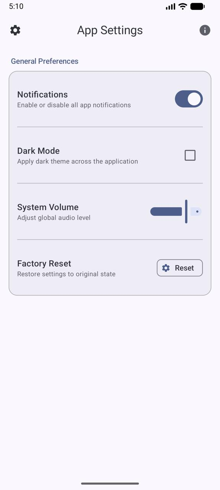

# Individual Assignment 3 – Jetpack Compose Layout Mastery

## Student Information
Name: Ashish Joshi  
Program: MS Artificial Intelligence  
University: Boston University  

---

# Q1 – Row/Column Mastery: Settings Screen

## Description
This screen demonstrates proper usage of Row and Column nesting in Jetpack Compose.

### Layout Structure
- Main container: Column
- Each setting row:
  - Row
    - Left: Column (Title + Supporting Text)
    - Right: Control (Switch / Checkbox / Slider / AssistChip)

### Material 3 Components Used
- CenterAlignedTopAppBar
- Card
- Switch
- Checkbox
- Slider
- AssistChip
- Snackbar
- HorizontalDivider

### Modifier Usage
- padding
- fillMaxWidth
- weight
- heightIn
- align
- border
- clip
- clickable
- background

### Screenshot

---

# Q2 – Box Layout: Profile Header + Overlay Card

## Description
This screen demonstrates layered UI using Box with overlapping components.

### Layout Structure
- Box as main header container
- Background gradient using Box + background
- Circular avatar using clip(CircleShape)
- Card partially overlapping header using offset
- zIndex used to control layering

### Material 3 Components Used
- TopAppBar
- Card
- AssistChip
- Badge
- Button
- Surface
- IconButton

### Modifier Usage
- clip(CircleShape)
- offset
- zIndex
- elevation (Card)
- fixed size
- fillMaxWidth

### Screenshot

---

# Q3 – FlowRow / FlowColumn: Tag Browser + Filters

## Description
This screen demonstrates dynamic wrapping layouts using FlowRow and FlowColumn.

### Layout Structure
- FlowRow for tag chips (wrap horizontally)
- FlowColumn for filter controls (wrap vertically)
- Selected Tags section updates dynamically

### Material 3 Components Used
- FilterChip
- AssistChip
- SuggestionChip
- Card
- CenterAlignedTopAppBar
- RadioButton
- FilledTonalButton

### Modifier Usage
- Arrangement.spacedBy()
- fillMaxWidth
- padding
- border (selected state)
- dynamic selected color change

### Screenshot

---

# Q4 – Responsive Layout Challenge (Phone vs Tablet)

## Description
This screen adapts layout based on screen width using BoxWithConstraints.

### Phone (Narrow Screen)
- Single Column layout
- TopAppBar + Bottom NavigationBar
- Scrollable content

### Tablet (Wide Screen)
- Row layout with two panes
  - Left: NavigationRail
  - Right: Detail content (Box + Column + LazyColumn)
- weight() used to allocate space
- fillMaxHeight() used for proper pane sizing

### Material 3 Components Used
- NavigationRail
- NavigationRailItem
- NavigationBar
- ListItem
- LazyColumn
- Card
- Button
- Badge

### Screenshots

Phone View:

Tablet View:

---

# AI Disclosure

AI assistance was used to:
- Understand layout requirements
- Improve modifier usage
- Refine component structure

All implementation, debugging, testing, and final integration were completed and verified by the student.
